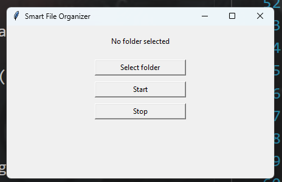
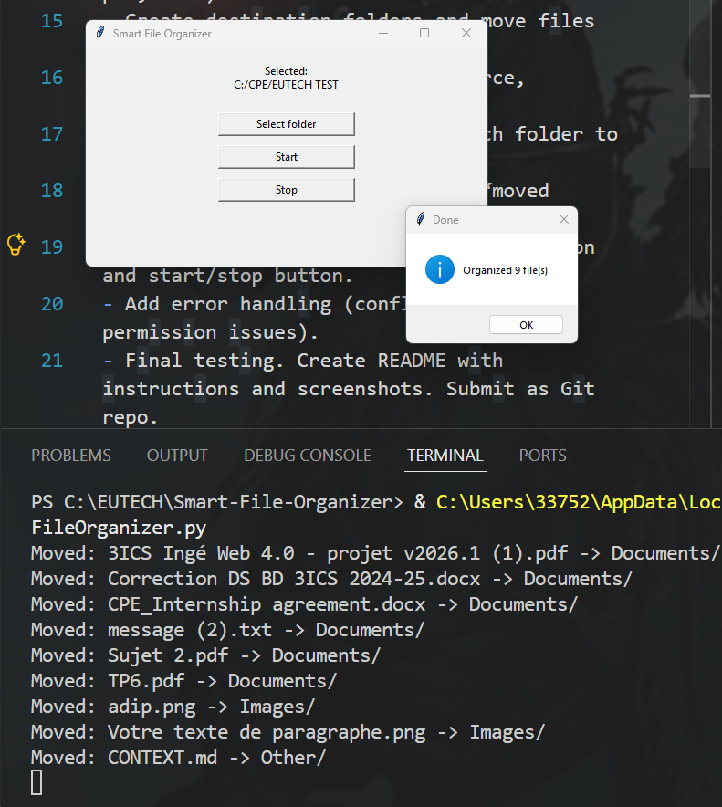

# Smart File Organizer

A small app that sorts the files of a folder into subfolders
(Images, Documents, Audio, etc.) based on their type.

## Features

- Sorts files into category folders automatically.
- Graphical interface (tkinter) with folder selection and Start/Stop buttons.
- Text menu as an alternative.
- Keeps a log of every move in `file_organizer.log`.
- Undo: puts the files back where they were.
- Handles name conflicts and files it cannot move, without crashing.

## Requirements

- Python 3
- tkinter (included with Python; on Linux: `sudo apt-get install python3-tk`)

## How to run

```
python file_organizer.py
```

A window opens:
1. Click **Select folder** and choose a folder.
2. Click **Start** to sort it.
3. Click **Stop** to close.

## Screenshots
Menu


Complet

## How the code is organized

- `FileOrganizer` — does the sorting, logging, undo, and error handling.
- `Menu` — the text interface.
- `OrganizerGUI` — the tkinter window.